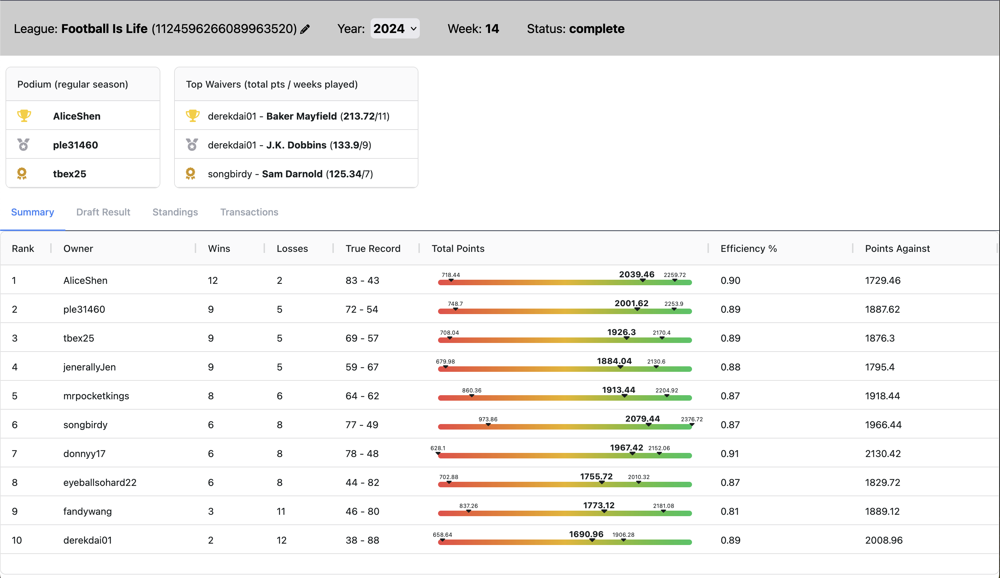
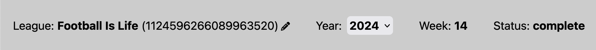

# deeper-sleeper
#### Dive deeper into Sleeper fantasy football league stats.
**https://deeper-sleeper.com**

#### Current Features:
- **Header**:

The **header** displays basic information such as League Name and ID, Year, Week, and Status. The league ID can be changed by clicking the pencil icon and entering a valid Sleeper ID (the dashboard will only populate if data for League IDs that've been loaded into the database). The Year can be selected via the dropdown to view previous years the league was active (the dropdown will only populate with years that there is data for in the database). Week shows the current week, if the season is completed it will remain on the last week of the *regular* season. Status simply shows the current status of the league (e.g. drafting, in season, completed). The header banner color will change depending on the status of the league.
- **Snapshots**:

**Snapshots** are small tables to display quick views for top performers/various statistics. Currently, "Podium" shows the top 3 (and sneakily last place with a short scroll) while "Top Waivers" show the top 3 waiver pickups that resulted in the most points scored among waiver moves. More to come!
- **Summary Tab**:

The **summary tab** contains a table showing various general statistics for the league up to this point. The teams are listed in order of standing with sortable columns. Custom Gauge chart shows the range of Minimum potential Total Points, Actual Total Points, and Maximum potential Total Points for each team; with minimum and maximum range being determined by lowest/highest potential points within the league.
- **Draft Result Tab**:

The **draft result tab** contains a table showing the results of the season's draft for the currently selected year (selected in the header). Includes thumbs up/down to show value of **pick position vs adp** as well as up/down arrows to show value of **pick position vs season rank**. Value icon indicators' colors fall on a spectrum to further convey value. If value falls within a +/-5 range, a neutral indicator is displayed instead.
- **Standings Tab**:

**The standings tab** displays a Nivo bump graph to show standings movement week-by-week. Includes hover effects to easily identify and follow the movement of specific teams.

- **Transactions Tab**: 

**The transactions tab** features a 2-column layout to display chronological order of transactions and a Nivo bar graph to display total counts of transaction types for each team. The Transactions List features a sticky Week header to make it easy to reference which week the transactions occurred. Each transaction is denoted by a colored tab on the right end to identify the type of transaction it is. If the toggle for failed transactions is enabled, failed transactions will have a light red background to discern them as failed transactions. Transaction types listed in the legend will only show types with at least 1 transaction (e.g. if no trades occur, 'trade' will not be listed in the graph legend).

---
---

**Goal**: Provide my league with a website to track, visualize, and compare team performances throughout the season by pulling league data from [Sleeper's API](https://docs.sleeper.com/#introduction)

**Tech Stack**:
- Python FastAPI
- React (Typescript) + Vite
- Tailwind CSS
- Docker
- MongoDB
- AWS ECR, ECS (and other supporting services to publicly host the site)

**Personal Objectives**:
- Practice and familiarize with Python through building an API and crunching some numbers.
- Enhance understanding of React by creating my own app from scratch.
- Learn how to host a website using cloud services such as AWS.
- Explore other tools and services, such as Github Actions, to build a modern, automated CI/CD pipeline.

**Infrastructure**

I decided to host using AWS because of semi-familiarity with it's services and capabilities and because of its general popularity. The below services are what I ultimately used to be able to host the app with a publicly accessible website and to have a rudimentary deployment process.
- **Elastic Container Service** (ECS): since I planned to use Docker to containerize the project locally, ECS seems like a good solution to easily transfer my Docker container definitions to AWS and host the containerized app. The app is organized into "api" and "web" code bases which will each have their own containers that are pushed to their separate ECR repositories.
  - **Elastic Container Registry** (ECR): to be able to run our containerized app in the cloud, ECR is utilized to hold our Docker images. After building, tagging, and pushing our Docker images to ECR, a **Task Definition** is created for each of our ECS services to assign their respective images to run and define other container parameters.
- **S3**: since this is a static site we could potentially reduce hosting costs by using S3 to host our static site rather than using ECS. To do allow static hosting site we simply create a private bucket in S3 and enable static website hosting and upload the build files of our Vite + React app.
- **CloudFront**: to distribute our static site and make them accessible, we use CloudFront as our CDN. We set up a bucket policy to allow our CloudFront distribution instance access to the bucket files and serve them across the internet.
- **Virtual Private Cloud** (VPC): a container for our containers. To allow our ECS services to communicate with each other, we can isolate them into a VPC, allowing them to communicate between each other via a private network within the VPC while also keeping them secure. More generally, a VPC allows us to define routing, security groups and access permissions, etc. between our services residing in the VPC.
- **Application Load Balancer** (ALB): while the VPC can allow communication between our services, the ALB allows us to define an entry point for public traffic into the VPC and also handles routing and load balancing to services in the VPC. It also allows us to keep the BE service private and restricted from public access.
  - The ALB also becomes necessary due to the nature of using React as the FE framework. Since our FE is a React app, our FE service does not actually run our application but instead serves up the web files to users to run the app in the browser. That means that any api requests that the FE makes are actually going to be made from the internet outside of the VPC, requiring the ALB to properly allow access and route to the backend service.
- **Route 53** and **AWS Certificate Manager** (ACM): Route 53 can be used to register a domain name. To also secure our site's connection over HTTPS rather than HTTP an SSL certificate was issued through ACM for our domain (and subdomains). With S3 static site hosting, we update existing A Records routing FE requests to the ALB to now route to our CloudFront distribution.